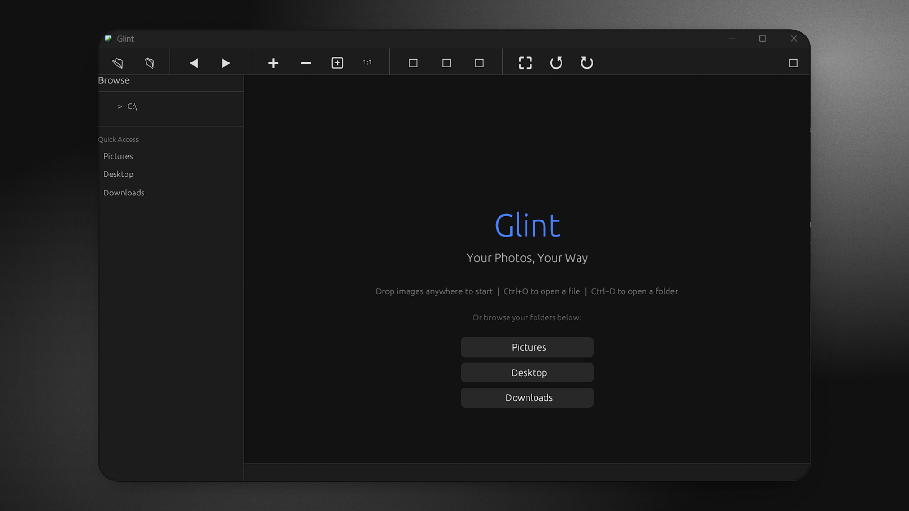
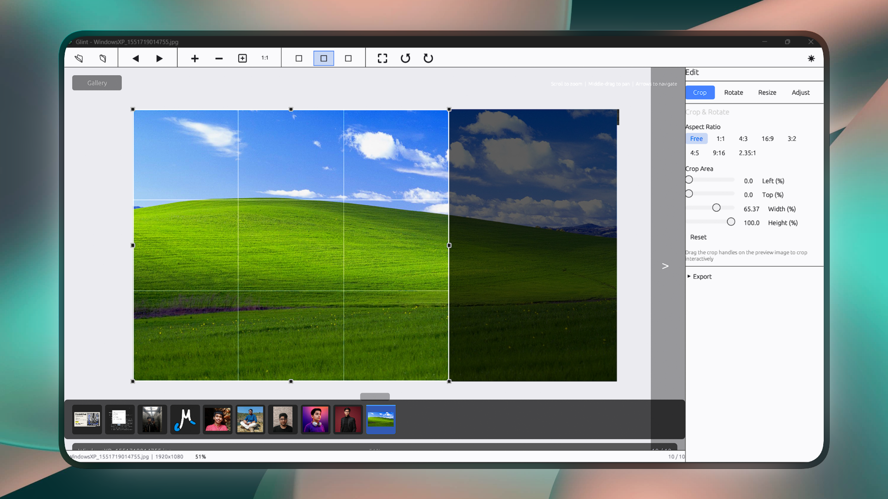
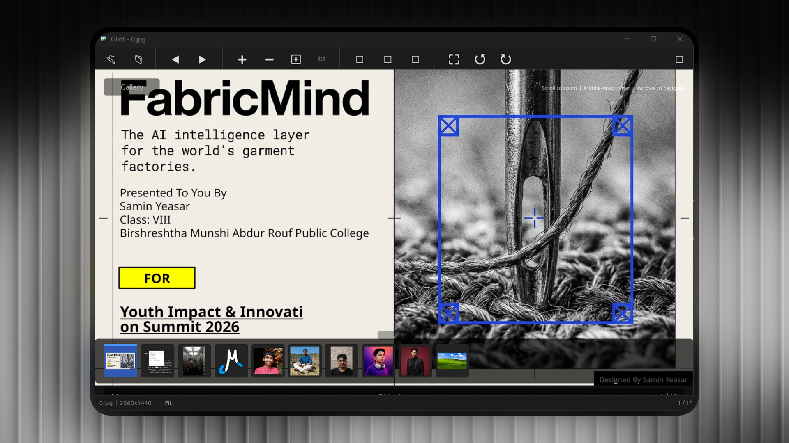

# Glint

A native Windows photo viewer and lightweight editor built in Rust. No Electron, no telemetry, no cloud nonsense. Just fast image viewing that feels like part of the OS.

## Why Glint?

Windows Photos has gotten slow and bloated. It takes forever to open, uses way too much memory, and keeps pushing features nobody asked for. Glint fixes that. It starts in under 150ms, uses about 50MB of RAM, and gets out of your way so you can actually look at your photos.

The whole thing is built in Rust with GPU acceleration. There is no web browser hiding inside this app. No telemetry reporting back to somewhere. No account required. It works offline, always has, always will.

## What it does

Loads images instantly. Lets you zoom, pan, and flip through folders with thousands of photos without stuttering. Handles standard formats, HEIC from your phone, and RAW files from DSLRs. The interface is minimal - toolbar on top, status bar on bottom, optional editor panel on the right if you need it.

### Supported formats

**Standard:** PNG, JPEG, WebP, GIF, BMP, TIFF, SVG, ICO, AVIF

**Modern:** HEIC, HEIF

**RAW:** CR2, CR3 (Canon), NEF (Nikon), ARW (Sony), DNG, RAF (Fujifilm), ORF (Olympus), RW2 (Panasonic), PEF (Pentax)

**Other:** QOI, EXR, HDR, DDS, TGA, PSD preview

### Editing tools

Basic stuff you actually use day to day:
- Crop with aspect ratio presets (1:1, 4:3, 16:9, 3:2, 4:5, 9:16)
- Rotate and flip
- Resize with common presets or custom dimensions
- Brightness, contrast, saturation, vibrance, gamma, exposure
- Highlights and shadows recovery
- White balance temperature and tint adjustment
- Blur, sharpen, noise reduction, vignette, grain
- Black and white conversion, sepia
- Export as PNG, JPEG, WebP, BMP, TIFF with quality control

### How it works

The app is built on egui for the UI and wgpu for GPU rendering. Images are decoded using the image crate with parallel loading via Rayon. Thumbnails are cached in SQLite so browsing folders with lots of images stays fast. File watching with the notify crate keeps the gallery in sync automatically.

### Windows integration

This is where Glint really shines. It registers itself as the default viewer for every image format on your system. File associations get written to the registry properly. Right-click any image and "Open with Glint" is there. Double-click any photo file and Glint opens it instantly.

There's also a context menu entry for folders so you can browse an entire directory of photos at once. The app auto-starts with Windows so it's always ready. It syncs with your Windows dark/light mode preference automatically.

### See it For yourself

<p align="center">
  
  <br><br>
  
  <br><br>
  
</p>


### Hidden features and shortcuts

Some things are discoverable, some are tucked away:

| Key | What it does |
|-----|---|
| Arrow keys / Space / Backspace | Navigate images |
| Mouse wheel | Zoom in/out |
| Middle mouse drag | Pan around |
| Double-click | Toggle fullscreen |
| F5 | Start/stop slideshow |
| R | Fit image to window toggle |
| Escape | Reset zoom or exit fullscreen |
| [ and ] | Rotate left / right |
| Delete | Move file to recycle bin |
| F2 | Rename file |
| Home / End | Jump to first / last image |
| Ctrl+O | Open file |
| Ctrl+D | Open folder |
| Ctrl+E | Toggle editor panel |
| Ctrl+G | Toggle thumbnail gallery |
| Ctrl+F / F11 | Fullscreen |
| Ctrl+T | Cycle themes (Dark/Light/AMOLED) |
| Ctrl+I | Show image info |
| Ctrl+C | Copy image path |
| Ctrl++ / Ctrl+- | Zoom in/out |
| Ctrl+0 | Fit to window |
| Ctrl+1 | Actual size (100%) |
| Ctrl+Q | Exit |
| Drag and drop | Drop files or folders onto the window |

## Getting started

### Download

Grab the latest `Glint-Setup-x64.exe` from the [Releases page](https://github.com/solez-ai/glint/releases). Run it, and Glint takes over as your default photo viewer. That's it.

### Build from source

```bash
git clone https://github.com/solez-ai/glint.git
cd glint
cargo build --release
```

Requires Rust 1.89.0+ and Windows 10/11. The first build takes a while since it compiles all dependencies from source.

### Command line

```
glint [options] [path]

Options:
  --fullscreen     Start in fullscreen
  --slideshow      Start in slideshow mode
  --background     Start minimized to tray
  --help           Show help
```

## Architecture

```
glint/
  assets/        - Icons and resources
  src/
    main.rs      - Entry point
    lib.rs       - Module declarations
    app.rs       - Core state and message routing
    ui/          - Toolbar, viewer, gallery, theme
    image/       - Loading, caching, processing
    renderer/    - GPU pipeline abstraction
    editor/      - Crop, rotate, resize, adjust, export
    metadata/    - EXIF and image metadata
    thumbnail/   - SQLite-backed thumbnail cache
    browser/     - File system navigation and sorting
    platform/    - Windows integration (registry, assoc, startup)
```

## Contributing

See [CONTRIBUTING.md](CONTRIBUTING.md) for setup instructions, coding guidelines, and how to submit changes.

## License

MIT License. Copyright (c) 2025 Samin Yeasar.

### Creator

**Samin Yeasar**
- GitHub: [github.com/solez-ai](https://github.com/solez-ai)
- Email: samin@mentormind.bd
